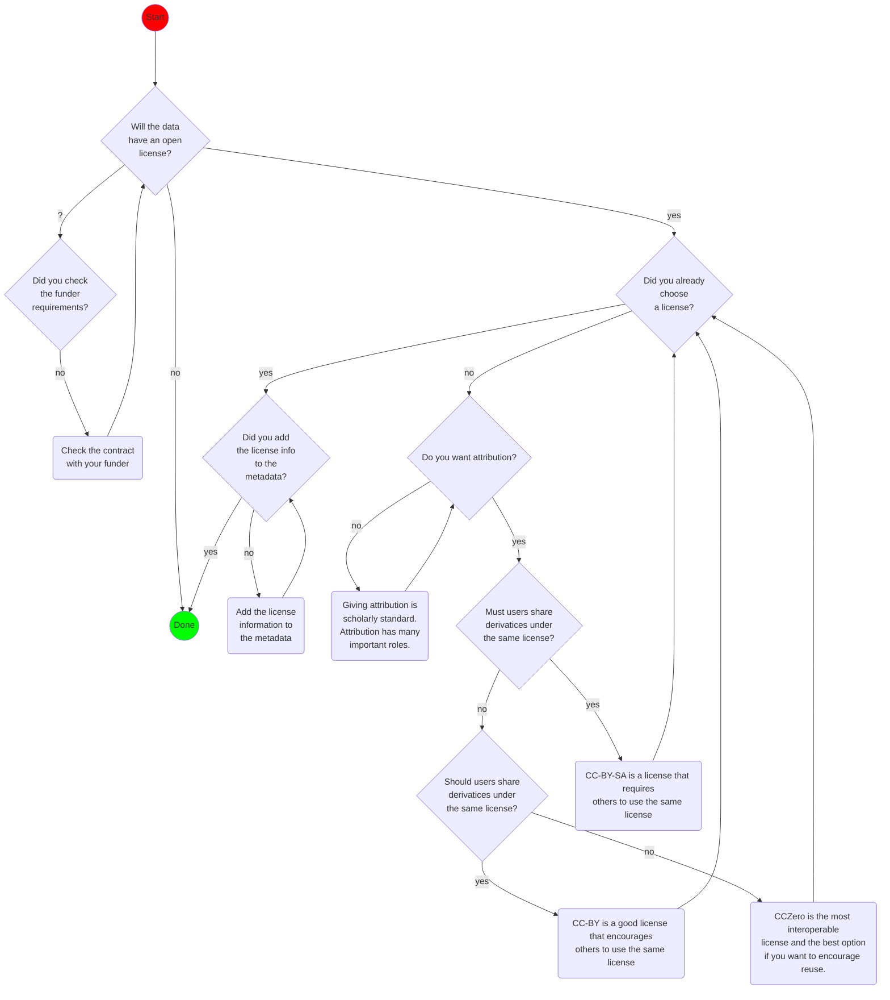

# open-data

```mermaid
flowchart TB
    start((Start))
    style start fill:#f00
    id1{Will the data\nhave an open\nlicense?}
    id2{Do I have to?}
    id2{Did you check\nthe funder\nrequirements?}
    done((Done))
    style done fill:#0f0
    id3(Check the contract\nwith your funder)
    id4{Did you already\nchoose\na license?}
    start --->id1
    metadata{Did you add\nthe license info\nto the\nmetadata?}
    addLicense(Add the license\ninformation to\nthe metadata)
    attribution{Do you want attribution?}
    yesYouDo(Giving attribution is\nscholarly standard.\nAttribution has many\nimportant roles.)
    shareAlike{Must users share\nderivatices under\nthe same license?}
    shareAlike2{Should users share\nderivatices under\nthe same license?}
    cczero(CCZero is the most interoperable\nlicense and the best option\nif you want to encourage reuse.)
    ccby(CC-BY is a good license that encourages\nothers to use the same license)
    ccbysa(CC-BY-SA is a license that requires\nothers to use the same license)
    id1 -- no -->done
    id1 -- ? -->id2
    id1 -- yes -->id4
    id2 -- no -->id3
    id3 -->id1 
    id4 -- no -->attribution
    id4 -- yes -->metadata
    metadata -- yes -->done
    metadata -- no -->addLicense
    addLicense -->metadata
    attribution -- no -->yesYouDo --> attribution
    attribution -- yes -->shareAlike
    shareAlike -- no -->shareAlike2
    shareAlike -- yes -->ccbysa
    shareAlike2 -- yes -->ccby
    shareAlike2 -- no -->cczero
    cczero -->id4
    ccby -->id4
    ccbysa -->id4
```
