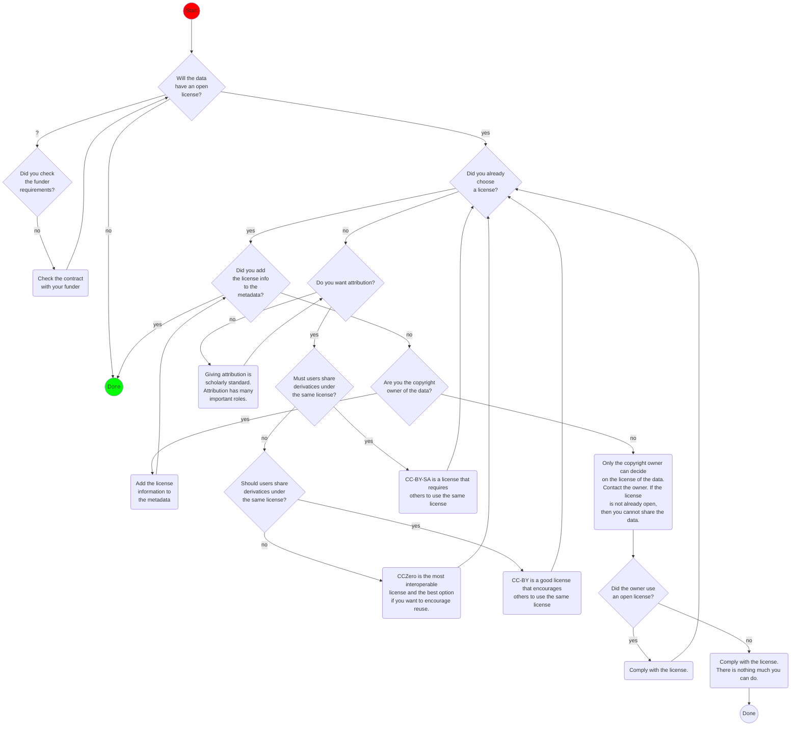

# open-data

```mermaid
flowchart TB
    start((Start))
    style start fill:#f00
    id1{Will the data\nhave an open\nlicense?}
    id2{Do I have to?}
    id2{Did you check\nthe funder\nrequirements?}
    done((Done))
    giveup((Done))
    style done fill:#0f0
    id3(Check the contract\nwith your funder)
    id4{Did you already\nchoose\na license?}
    start --->id1
    metadata{Did you add\nthe license info\nto the\nmetadata?}
    owner{Are you the copyright\nowner of the data?}
    addLicense(Add the license\ninformation to\nthe metadata)
    attribution{Do you want attribution?}
    yesYouDo(Giving attribution is\nscholarly standard.\nAttribution has many\nimportant roles.)
    shareAlike{Must users share\nderivatices under\nthe same license?}
    shareAlike2{Should users share\nderivatices under\nthe same license?}
    cczero(CCZero is the most interoperable\nlicense and the best option\nif you want to encourage reuse.)
    ccby(CC-BY is a good license that encourages\nothers to use the same license)
    ccbysa(CC-BY-SA is a license that requires\nothers to use the same license)
    checkUpstream(Only the copyright owner can decide\non the license of the data.\nContact the owner. If the license\nis not already open,\nthen you cannot share the data.)
    wasOpen{Did the owner use\nan open license?}
    respectLicence(Comply with the license.)
    respectLicence2(Comply with the license.\nThere is nothing much you can do.\n)
    id1 -- no -->done
    id1 -- ? -->id2
    id1 -- yes -->id4
    id2 -- no -->id3
    id3 -->id1 
    id4 -- no -->attribution
    id4 -- yes -->metadata
    metadata -- yes -->done
    metadata -- no -->owner
    owner -- yes -->addLicense
    owner -- no -->checkUpstream
    checkUpstream-->wasOpen
    wasOpen -- yes -->respectLicence
    wasOpen -- no -->respectLicence2
    respectLicence -->id4
    respectLicence2 -->giveup
    addLicense -->metadata
    attribution -- no -->yesYouDo --> attribution
    attribution -- yes -->shareAlike
    shareAlike -- no -->shareAlike2
    shareAlike -- yes -->ccbysa
    shareAlike2 -- yes -->ccby
    shareAlike2 -- no -->cczero
    cczero -->id4
    ccby -->id4
    ccbysa -->id4
```
